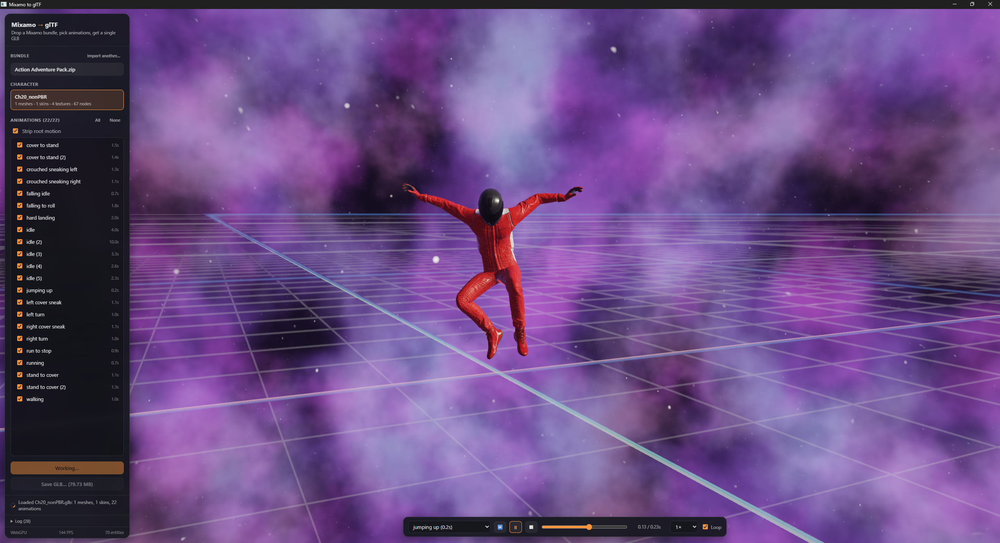

# mixamo-to-gltf



Convert [Mixamo](https://www.mixamo.com) character + animation bundles into a single GLB, with a live [Nightshade](https://github.com/matthewjberger/nightshade) viewer to verify the result before saving. The engine runs inside a web worker against an OffscreenCanvas and renders through WebGPU off the main thread. A [Leptos](https://leptos.dev) UI drives it from the main thread, and a native webview shell turns the same bundle into a desktop app and hosts the native conversion pipeline.

## Usage

```bash
just init
just run
```

Drag a Mixamo `.zip` (a character FBX plus animation FBX files, like an animation pack) onto the window. The app:

1. Parses every FBX in the archive (ufbx, in memory). Files over 1 MB are treated as character models, the rest as animation clips.
2. Builds a single GLB: the character's skinned meshes, skeleton, embedded PNG textures, and every selected animation clip, converted from FBX centimeters to glTF meters, with root motion optionally stripped.
3. Loads that exact GLB straight into the viewer, so what you see is what the file contains. The first clip plays looping; the playback bar selects clips, scrubs the timeline, and controls speed and looping.
4. `Save GLB…` writes the previewed bytes wherever you choose.

Tweak the animation selection (`All` / `None` / per-clip) or the root-motion toggle, then `Convert & Preview` to rebuild.

## Workspace

- `protocol`, the message and data types both sides share: worker messages, animation commands, and the `/api/*` request/response bodies.
- `convert`, the native conversion pipeline: zip → FBX (via nightshade's `fbx` feature / ufbx) → GLB (gltf-json).
- `worker`, the wasm module inside the web worker: the engine `World`, GLB loading/spawning, camera framing, and the animation player.
- the root crate (`page`), the Leptos UI: drop zone, conversion panel, playback bar, and the viewport bridge.
- `desktop`, the native shell: a webview window over the web bundle, served from an ephemeral localhost port, plus the `POST /api/import|build|save` conversion endpoints.

Conversion requires the desktop shell (`just run`); `just run-web` serves the viewer in a browser but has no native FBX pipeline behind it.

## License

Dual-licensed under MIT or Apache-2.0, at your option.
